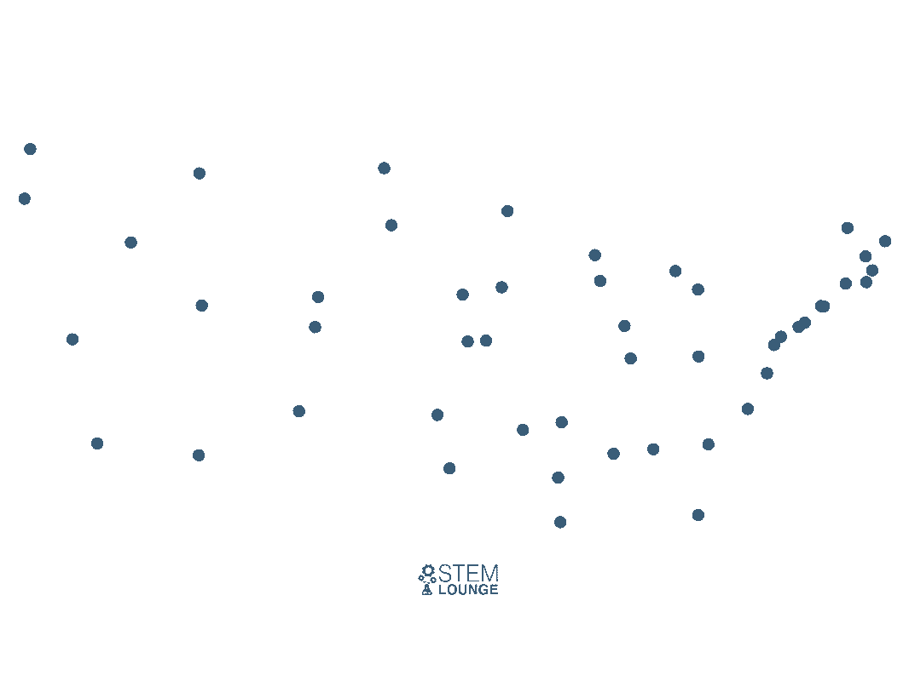
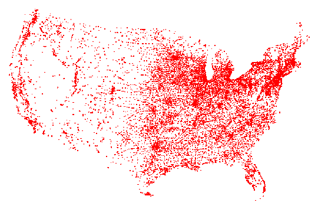
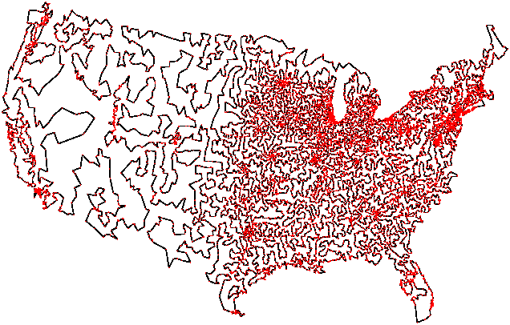

# Resolução de Problemas com Grafos
Orientador: Prof. Me Ricardo Carubbi

## Trabalho Prático 4

Esta atividade vale `1,0 ponto`.

## Tema

Implemente, em **Python** ou em **Java**, heurísticas de inserção para o
**Traveling Salesman Problem** (TSP).

Neste trabalho, o foco não é encontrar necessariamente o circuito (*tour*) ótimo,
mas sim comparar duas heurísticas clássicas de construção de circuitos (*tours*):

1. **nearest insertion**
2. **smallest insertion**

## Bases oficiais

As bases oficiais da disciplina para este trabalho são:

- `algs4-py`, para implementações em **Python**;
- `algs4-java`, para implementações em **Java**.

## Objetivo

Aplicar os conceitos de:

- modelagem de cidades como **pontos 2D**;
- cálculo de **distância euclidiana**;
- construção incremental de um circuito (*tour*);
- comparação entre heurísticas de inserção;
- visualização do circuito (*tour*) gerado.

## O que o aluno deve implementar

O projeto-base deste trabalho já fornece:

- o `main`;
- a leitura dos arquivos de entrada;
- a estrutura da classe `Point`, responsável por representar cada cidade como
  um ponto no plano cartesiano, armazenando suas coordenadas e oferecendo as
  operações geométricas básicas necessárias ao cálculo das distâncias;
- a estrutura da classe `Tour`, responsável por representar o circuito
  (*tour*) parcial ou final, manter a sequência de cidades visitadas e apoiar o
  cálculo do comprimento do percurso;
- o visualizador dos circuitos (*tours*).

O foco da implementação do aluno deve estar apenas em completar, na classe
`Tour`, os métodos:

- `insertNearest(Point p)`, responsável por inserir a nova cidade no circuito
  (*tour*) com base no critério de vizinhança mais próxima previsto pela
  heurística `nearest insertion`;
- `insertSmallest(Point p)`, responsável por inserir a nova cidade na posição
  que provoque o menor aumento no comprimento do circuito (*tour*), conforme a
  heurística `smallest insertion`.

Não é necessário criar novas classes para este trabalho; o aluno deve
completar apenas os métodos indicados na classe `Tour`.

### Como as heurísticas funcionam

Na implementação deste trabalho, as cidades devem ser inseridas uma a uma no
circuito (*tour*) que está sendo construído.

#### `nearest insertion`

Na heurística `nearest insertion`, o circuito (*tour*) começa com um subtour
inicial e cresce por inserções sucessivas. A cada passo, deve-se considerar as
cidades que ainda não pertencem ao circuito atual e identificar aquela que está
mais próxima de alguma cidade já presente no circuito.

Depois de escolher essa nova cidade, ela deve ser inserida na posição do
circuito que resulte no menor aumento possível no comprimento total do
percurso. Assim, a heurística segue duas etapas bem definidas: primeiro
seleciona-se a próxima cidade pela proximidade ao circuito atual; depois
escolhe-se a melhor posição para inseri-la no circuito.



**Figura 1. Animação ilustrativa da heurística `nearest insertion`.** Fonte: STEM Lounge, seção “Nearest Insertion”, em <https://stemlounge.com/animated-algorithms-for-the-traveling-salesman-problem/>

#### `smallest insertion`

Na heurística `smallest insertion`, a decisão principal não é escolher a cidade
mais próxima do circuito, mas sim identificar qual inserção produz o menor
aumento no comprimento total do percurso.

Para isso, a nova cidade candidata deve ser analisada em relação às posições possíveis do circuito atual. O aluno deve calcular quanto o comprimento total do circuito aumentaria se essa cidade fosse inserida entre duas cidades consecutivas já existentes.

A cidade deve ser colocada na posição que produzir o menor aumento no comprimento do circuito. Em outras palavras, enquanto `nearest insertion` escolhe primeiro a próxima cidade e depois sua posição, `smallest insertion` prioriza diretamente a inserção de menor custo no circuito atual.

Na página de referência abaixo, essa mesma ideia aparece com o nome
`Cheapest Insertion`.


**Figura 2. Animação ilustrativa da heurística `smallest insertion`, chamada de `Cheapest Insertion` na referência utilizada.** Fonte: STEM Lounge, seção “Cheapest Insertion”, em <https://stemlounge.com/animated-algorithms-for-the-traveling-salesman-problem/>

#### Resumo das diferenças principais

- `nearest insertion`: primeiro escolhe a cidade que está mais próxima do circuito atual; depois decide em que posição essa cidade será inserida. Enfatiza a proximidade da próxima cidade ao circuito já construído.
- `smallest insertion`: prioriza diretamente a inserção que provoca o menor aumento no comprimento do circuito. Enfatiza o impacto da inserção no custo total do percurso.

## O que não deve ser implementado

Neste trabalho, os alunos **não devem implementar**:

- solver exato para TSP;
- programação dinâmica;
- branch and bound;
- 2-opt ou outras heurísticas de melhoria.

## Entrada

O trabalho utiliza arquivos no formato:

```text
largura altura
x0 y0
x1 y1
...
```

onde:

- `largura` e `altura` definem o plano de desenho;
- cada linha `x y` representa uma cidade como ponto no plano.

Embora o problema possa ser modelado conceitualmente como um **grafo completo
ponderado**, a implementação deste trabalho não exige a construção explícita
desse grafo. As cidades devem ser representadas como pontos no plano, e os
pesos das conexões entre pares de cidades devem ser calculados sob demanda por
meio da distância euclidiana. Assim, o foco da solução recai sobre a
construção do circuito (*tour*) pelas heurísticas de inserção, e não sobre a
materialização de todas as arestas do grafo.

## Visualização

O visualizador deste trabalho deve ser baseado em `TSPVisualizer.java`,
presente na estrutura local do T4.

Na visualização:

- o circuito (*tour*) de `nearest insertion` deve aparecer em uma cor;
- o circuito (*tour*) de `smallest insertion` deve aparecer em outra;
- os pontos da instância devem ser exibidos no plano;
- os comprimentos dos circuitos (*tours*) devem aparecer na legenda.

## Exemplos de entrada fornecidos

Os seguintes arquivos podem ser usados como exemplos:

- `dados/tsp10.txt`
- `dados/tsp10-nearest.txt`
- `dados/tsp10-smallest.txt`
- `dados/tsp10-optimal.txt`
- `dados/usa13509.txt`

Observação:

- a entrada de exemplo a ser usada como referência principal é `dados/tsp10.txt`;
- esse arquivo deve ser usado para depuração das heurísticas, porque o projeto
  inclui respostas de referência para comparação;
- a execução final do trabalho deve ser feita com `dados/usa13509.txt`.

Respostas de referência disponíveis para a entrada de depuração:

- `dados/tsp10-nearest.txt`
- `dados/tsp10-smallest.txt`
- `dados/tsp10-optimal.txt`

Descrição desses arquivos de referência:

- `dados/tsp10-nearest.txt`: mostra o circuito (*tour*) construído passo a passo pela heurística `nearest insertion`, incluindo o comprimento acumulado após cada inserção;
- `dados/tsp10-smallest.txt`: mostra o circuito (*tour*) construído passo a passo pela heurística `smallest insertion`, incluindo o comprimento acumulado após cada inserção;
- `dados/tsp10-optimal.txt`: apresenta um circuito (*tour*) ótimo de referência para a instância `tsp10.txt`, permitindo comparar a qualidade das heurísticas com uma solução melhor conhecida.

Instância de execução e apresentação do trabalho:

- `dados/usa13509.txt`
- essa instância deve ser usada para calcular os circuitos (*tours*) finais e
  apresentar os comprimentos obtidos pelas heurísticas;
- descrição e contexto: <https://www.math.uwaterloo.ca/tsp/gallery/itours/usa13509.html>



**Figura 3. Distribuição espacial dos pontos da instância `usa13509` sobre o mapa dos Estados Unidos, representando as `13.509` cidades consideradas nessa base de dados**. A imagem mostra apenas a localização das cidades no plano, sem exibir arestas nem o circuito (*tour*) resultante, e serve como referência visual do conjunto de entrada utilizado na execução e na apresentação do trabalho. Fonte: <https://www.math.uwaterloo.ca/tsp/gallery/idata/usa13509.html>



**Figura 4. Circuito (*tour*) ótimo associado à instância `usa13509`.** Segundo a fonte, Applegate, Bixby, Chvátal e Cook resolveram essa instância em 1998; ela é composta pelas localizações das cidades dos EUA com população de pelo menos 500 habitantes, com base em uma lista da CIA. A solução ótima para `USA13509` é o circuito apresentado na figura, com comprimento `19982859`; a página da solução ótima pode ser consultada em <https://www.math.uwaterloo.ca/tsp/usa13509/usa13509_sol.html>. Uma versão em maior resolução do circuito (*tour*) pode ser consultada na *Pictorial History of the TSP*: <https://www.math.uwaterloo.ca/tsp/history/pictorial/pictorial.html>. Fonte: <https://www.math.uwaterloo.ca/tsp/gallery/itours/usa13509.html>

## O que o programa deve fazer

O programa principal deve:

1. ler um arquivo de entrada no formato indicado;
2. carregar os pontos da instância;
3. construir um circuito (*tour*) usando `nearest insertion`;
4. construir um circuito (*tour*) usando `smallest insertion`;
5. informar o número de pontos;
6. informar o comprimento total dos dois circuitos (*tours*);
7. acionar a visualização dos circuitos (*tours*).

Para a instância de execução `usa13509.txt`, o programa deve ser executado para
calcular e apresentar os comprimentos produzidos pelas heurísticas.

## Pontuação

A nota do trabalho será dividida da seguinte forma:

- **0,5 ponto**: implementação técnica;
- **0,5 ponto**: vídeo explicativo.

### Parte técnica: `0,5`

- implementar corretamente `insertNearest(Point p)`: `0,20`
- implementar corretamente `insertSmallest(Point p)`: `0,20`
- exibir corretamente os circuitos (*tours*) e seus comprimentos: `0,10`

### Vídeo explicativo: `0,5`

O vídeo deve apresentar:

- o problema do TSP;
- a diferença entre as duas heurísticas;
- a implementação feita em `Tour`;
- a execução do programa;
- a visualização gerada.

## Critérios de avaliação

- correção da modelagem por pontos;
- correção de `nearest insertion`;
- correção de `smallest insertion`;
- correção do comprimento calculado;
- clareza da visualização;
- clareza técnica da explicação.

## Estrutura esperada do projeto

```text
t4-tsp/
├── README.md
├── T4.md
├── dados/
│   ├── tsp10.txt
│   ├── usa13509.txt
│   └── arquivos de referência para depuração
└── src/
    ├── Main.java | main.py
    ├── Point.java | point.py
    ├── Tour.java | tour.py
    ├── TSPVisualizer.java | visualizer equivalente
    └── demais classes auxiliares utilizadas
```

## Entrega

A entrega deverá conter:

- o projeto completo em um repositório GitHub;
- o arquivo `README.md` com:
  - instruções de execução;
  - breve descrição das heurísticas;
  - **link do vídeo**;
- o vídeo hospedado por link.

## Observações

- O `main` já é fornecido para que o foco do aluno fique nas heurísticas.
- As bases oficiais da disciplina são `algs4-py` e `algs4-java`.
- O material entregue no T4 deve ser suficiente para implementação sem depender de outras pastas do repositório.
